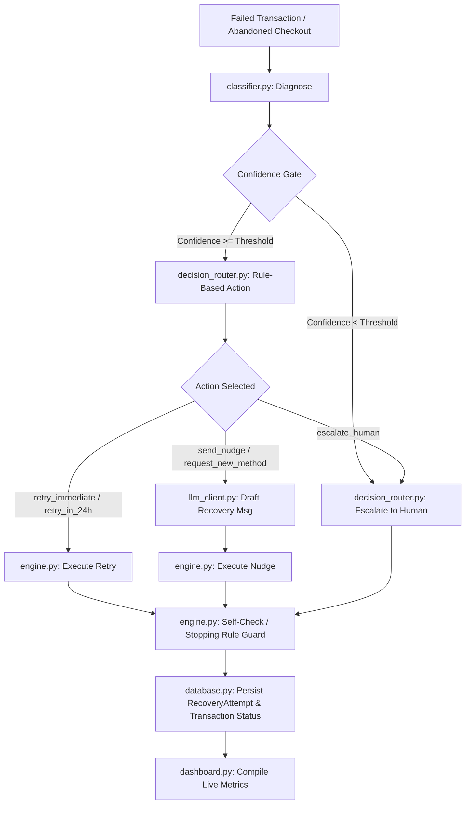

# Recovery Copilot
### Bounded, auditable revenue-recovery agent for failed payments and abandoned checkouts.

---

## Problem Statement
When online payments fail or customers abandon checkouts, businesses lose significant revenue due to static, generic, or poorly timed recovery attempts. Standard payment gateways rely on basic retries or spammy notifications that ignore the underlying failure context, leading to customer fatigue, high operational costs, and non-compliance with messaging regulations. Recovery Copilot solves this by implementing a bounded, context-aware recovery lifecycle that classifies payment failures, routes them through a deterministic decision engine, and dynamically drafts compliant customer-facing communications.

---

## How It Works

Recovery Copilot processes payments through a strict five-stage pipeline (**Diagnose → Decide → Execute → Stop → Report**):

1. **Diagnose**: Classifies why a payment failed based on the structured gateway failure code. This step is deterministic and does not use an LLM, ensuring speed and reliability.
2. **Decide**: Maps the failure diagnosis to a specific action using a strict rule-lookup table. A confidence gate checks the classification certainty; if the confidence is below the defined threshold, the transaction is routed to human review.
3. **Execute**: Simulates the recovery action (such as instant retry, 24-hour delayed retry, SMS nudges, or request for new payment method). If it is a nudge or payment method update, the LLM generates a personalized notification.
4. **Stop**: Enforces limits to protect user experience. A stopping rule stops retrying if the attempts exceed `MAX_RETRY_ATTEMPTS`, and a self-check blocks the system from repeating an action that already failed for a transaction.
5. **Report**: Synthesizes execution data, showing gross vs. **net** recovery metrics (adjusting for action costs like SMS or human labor) and logging a complete audit trail for each transaction.

### Architecture Diagram



---

## Key Design Decisions

- **Deterministic Diagnosis & Routing (No LLM in Hot Path)**: Payment gateway failure codes are already structured data (e.g., `insufficient_funds`, `expired_card`). Using an LLM to interpret these is unnecessary, expensive, and adds latency. Thus, diagnosis and action-selection are completely deterministic, making the financial decision path auditable.
- **LLM Scoped to Copywriting Only**: LLM usage (via OpenRouter) is isolated to a single, low-risk task: writing the customer-facing recovery message. The LLM has zero authority to decide financial actions or routing.
- **Confidence Gating**: Each diagnosis returns a confidence score (defined in [classifier.py](file:///d:/Al%20websites/recovery-bot/recovery-bot/app/services/classifier.py)). If the confidence is below the threshold (default: `0.70`), the transaction is routed to `escalate_human`. Unseen/unknown errors get a default confidence of `0.40`, automatically forcing human review.
- **Strict Stopping Rule**: To prevent spamming customers, the engine enforces a hard attempt cap (`MAX_RETRY_ATTEMPTS`, default: `3`) per transaction. Once triggered, the engine logs a `stopping_rule_triggered` attempt with action `give_up`.
- **Anti-Repetition Self-Check**: The engine keeps track of previous attempts. If an action is selected that has already failed for that specific transaction (e.g., a nudge was sent but the customer did not pay), the engine overrides the action to `escalate_human` to prevent repetitive messaging.
- **Regulatory Compliance Framing**: As annotated in [decision_router.py](file:///d:/Al%20websites/recovery-bot/recovery-bot/app/services/decision_router.py):
  > The retry rules routing table, strict MAX_RETRY_ATTEMPTS bounds, and the escalation gates implemented herein are designed in accordance with RBI's e-mandate retry-limit guidelines and TRAI DND regulations for non-intrusive, compliant automated customer financial messaging.

---

## Features

- **Live Dashboard**: A fully responsive dark-mode SPA displaying real-time financial performance:
  - **Net Amount Recovered**: Tracks gross amount recovered minus the operational cost of recovery actions.
  - **Overall Recovery Rate**: Displays the percentage of recovered transactions with a dynamic SVG progress ring.
  - **Amount Still At Risk**: Live aggregation of value stuck in failed, pending, or lost states.
  - **Escalated to Human**: A live count of transactions requiring human review, equipped with informative compliance tooltips.
  - **Promises to Pay**: Live tracking of intent captured from customer SMS nudges.
- **Recovery Rate by Failure Type**: Horizontal bar charts displaying recovery rates broken down by specific gateway codes.
- **Actions Taken Breakdown**: An interactive conic-gradient donut chart showing action distribution (`retry`, `nudge`, `new method`, `escalate`).
- **Interactive Onboarding Tour**: A step-by-step interactive walkthrough of the SPA's core features (Data Generation, Recovery Loops, Key Metrics, Failure Analytics, and AI Audit Trail).
- **Scenario Switcher**: A drop-down to generate synthetic batches representing distinct distribution shifts:
  - `Baseline Mix`: Normal distribution of payment failures.
  - `Card Heavy Mix`: High frequency of card-level issues (e.g., expired card, invalid CVV).
  - `Infra Heavy Mix`: High frequency of infrastructure errors (e.g., network timeout, bank down).
  - `Ambiguous Heavy Mix`: High frequency of generic declines (which triggers more human escalations).
- **Run-Until-Resolved Loop**: Simulates running the recovery cycle continuously until every transaction reaches a terminal state (`recovered`, `lost`, or `escalated`).
- **Explainable Audit Trail**: Clicking any transaction row expands a detailed historical timeline of attempts, displaying the exact timestamp, diagnosis, action taken, and reasoning.
- **CSV Data Exporter**: An option in the settings dropdown to download the current transaction list as a CSV file with automatic HTML and character escaping.
- **Security & XSS Protection**: The frontend sanitizes all dynamic inputs (customer IDs, failure codes, and LLM text) using a robust HTML escaping mechanism to prevent Cross-Site Scripting (XSS).

---

## API Reference

All requests and responses use JSON format. Pydantic schemas enforce type safety.

### 1. Transactions Router (`/transactions`)

#### `POST /transactions/generate`
Generates a new synthetic batch of failed transactions.
- **Request Body**:
  ```json
  {
    "n": 60, // integer, default: 60, min: 1, max: 500
    "seed": null, // optional integer for deterministic generation
    "scenario": "baseline" // optional string ("baseline", "card_heavy", "infra_heavy", "ambiguous_heavy")
  }
  ```
- **Response Shape** (`list[TransactionOut]`):
  ```json
  [
    {
      "id": 1,
      "customer_id": "8f2d5a1b",
      "amount": 2540.50,
      "failure_code": "insufficient_funds",
      "status": "failed",
      "attempts_count": 0,
      "created_at": "2026-08-24T01:10:08",
      "promise_to_pay": false,
      "promised_amount": 0.0
    }
  ]
  ```

#### `GET /transactions`
Lists all transactions currently stored in the SQLite database.
- **Response Shape**: `list[TransactionOut]` (same schema as above).

---

### 2. Recovery Router (`/recovery`)

#### `POST /recovery/run-batch`
Runs a single recovery pass over every transaction with status `failed` or `pending`.
- **Query Parameters**:
  - `confidence_threshold` (optional float): Overrides the default confidence threshold.
- **Response Shape** (`list[AttemptOut]`):
  ```json
  [
    {
      "id": 1,
      "transaction_id": 1,
      "attempt_number": 1,
      "diagnosis": "insufficient_funds",
      "confidence": 0.95,
      "action_taken": "retry_in_24h",
      "reasoning": "Transient/liquidity issue — safe to retry after a cooling window.",
      "cost": 0.0,
      "outcome": "failed",
      "escalated": false,
      "timestamp": "2026-08-24T01:11:00"
    }
  ]
  ```

#### `POST /recovery/run-until-resolved`
Runs consecutive recovery attempts for all open transactions until they either succeed, escalate, or hit the stopping rule limit.
- **Query Parameters**:
  - `confidence_threshold` (optional float): Overrides the default confidence threshold.
- **Response Shape**: `list[AttemptOut]` (history of all attempts generated during the loops).

#### `POST /recovery/run/{transaction_id}`
Executes a single recovery step for a specific transaction.
- **Path Parameters**:
  - `transaction_id` (integer, required)
- **Response Shape**: `AttemptOut`.

#### `GET /recovery/audit/{transaction_id}`
Fetches the chronological list of recovery attempts for a single transaction.
- **Path Parameters**:
  - `transaction_id` (integer, required)
- **Response Shape**: `list[AttemptOut]` (ordered by `attempt_number` ascending).

---

### 3. Dashboard Router (`/dashboard`)

#### `GET /dashboard/summary`
Returns aggregated analytics metrics for the control room charts and widgets.
- **Response Shape**:
  ```json
  {
    "total_transactions": 60,
    "recovered_count": 22,
    "lost_count": 15,
    "escalated_terminal_count": 8,
    "pending_count": 15,
    "escalated_count": 11,
    "gross_amount_recovered": 54200.00,
    "total_action_cost": 555.50,
    "net_amount_recovered": 53644.50,
    "amount_still_at_risk": 38100.00,
    "promise_to_pay_count": 4,
    "promised_amount_total": 8500.00,
    "overall_recovery_rate": 0.367,
    "by_failure_type": {
      "insufficient_funds": { "total": 15, "recovered": 7, "recovery_rate": 0.467 },
      "card_declined_generic": { "total": 6, "recovered": 0, "recovery_rate": 0.0 }
    },
    "action_counts": {
      "retry": 18,
      "nudge": 12,
      "new_method": 6,
      "escalate": 11
    }
  }
  ```

#### `GET /health`
Liveness probe check. Returns `{"status": "ok"}`.

#### `GET /`
Serves the dynamic single page application interface (`index.html`).

---

## Setup & Run Instructions

### Prerequisites
- Python 3.10 or higher installed on your system.

### Installation

1. Clone or navigate to the repository directory:
   ```bash
   cd recovery-bot
   ```

2. Create a virtual environment and activate it:
   ```bash
   python -m venv venv
   # On Windows (PowerShell):
   .\venv\Scripts\Activate.ps1
   # On macOS/Linux:
   source venv/bin/activate
   ```

3. Install the required dependencies:
   ```bash
   pip install -r requirements.txt
   ```

4. Set up environment variables. Copy `.env.example` to `.env`:
   ```bash
   cp .env.example .env
   ```

5. Configure your variables inside `.env`:
   - `OPENROUTER_API_KEY`: Paste your OpenRouter API key here to enable LLM-generated recovery messaging.
   - **Fallback Behavior**: If this key is omitted or the OpenRouter API request fails, the application automatically falls back to predefined, hardcoded templates. This ensures the demo never breaks during live presentations.
   - `OPENROUTER_MODEL`: Defaults to `meta-llama/llama-3.1-8b-instruct:free` if not specified.
   - `DATABASE_URL`: Defaults to `sqlite:///./recovery.db`.
   - `MAX_RETRY_ATTEMPTS`: Defaults to `3`.
   - `CONFIDENCE_THRESHOLD`: Defaults to `0.70`.

### Running the Server
Start the FastAPI server via Uvicorn:
```bash
uvicorn app.main:app --reload
```
Once started, open `http://127.0.0.1:8000/` in your web browser to interact with the dashboard.

---

## Seeding Demo Data

The repository contains a seeding script designed to generate a known-good demonstration dataset.
To run the seeding script:
```bash
python scripts/seed_demo.py
```
### Why it exists and how it works:
- It drops and recreates the SQLite database tables to ensure a clean slate.
- It generates exactly 60 transactions using the `baseline` scenario configuration with a fixed random seed (`42`). This creates an identical set of payment failures every run.
- It immediately executes the `run_until_resolved` loop over the batch.
- **Purpose**: This ensures that when an evaluator first opens the dashboard, they are not presented with empty charts. Instead, they immediately see a rich history of attempts, costs, recovered amounts, and audit trails.

---

## Replay Harness (Anti-Cherry-Picking Proof)

A major criticism of automated agents is that their recovery rates are overfit or cherry-picked to fit a specific dataset. To address this, Recovery Copilot includes a stress-test harness.
To run the harness:
```bash
python scripts/replay_harness.py
```
### How it works:
- It systematically resets the DB and simulates recovery cycles across four distinct synthetic failure distributions:
  1. `baseline`: Default failure proportions.
  2. `card_heavy`: High volume of expired cards and invalid CVVs.
  3. `infra_heavy`: High volume of network timeouts and bank server downtime.
  4. `ambiguous_heavy`: High volume of generic card declines (triggers more human escalations).
- It runs a batch recovery and prints the comparative stats (`recovery_rate`, `net_amount_recovered`, `escalated_count`, `lost_count`) side-by-side.
- **Why it matters**: It proves that the recovery engine is robust under varying circumstances and isn't just hardcoded to succeed on a single predefined set of failures. It serves as anti-cherry-picking proof to the judges, verifying that the agent's performance has been tested across realistic distribution shifts.

---

## Deployment

No deployment configuration files (such as `render.yaml`, `Procfile`, or `Dockerfile`) currently exist in this repository. 

To deploy this application to cloud platforms (like Render or Fly.io), you will need to add a `Procfile` specifying the web command:
```web: uvicorn app.main:app --host 0.0.0.0 --port $PORT```
And configure the `DATABASE_URL` environment variable to point to a persistent SQLite mount or an external PostgreSQL database.

---

## Project Structure

```
recovery-bot/
├── app/
│   ├── core/
│   │   ├── config.py         # App settings, action costs, environment configuration
│   │   └── database.py       # SQLAlchemy engine and session dependency
│   ├── models/
│   │   ├── models.py         # Transaction and RecoveryAttempt DB models
│   │   └── schemas.py        # Pydantic validation schemas
│   ├── routers/
│   │   ├── dashboard.py      # Endpoints for aggregated stats
│   │   ├── recovery.py       # Endpoints for running recovery cycles and audit logs
│   │   └── transactions.py   # Endpoints for batch transaction generation
│   ├── services/
│   │   ├── classifier.py     # Deterministic gateway error classification
│   │   ├── dashboard.py      # Aggregation and metric calculation logic
│   │   ├── data_generator.py # Synthetic transaction generationmixes
│   │   ├── decision_router.py# Bounded rules table and confidence gate
│   │   ├── engine.py         # Transaction lifecycle execution and loop controls
│   │   └── llm_client.py     # OpenRouter client for compliant copy drafting
│   └── main.py               # FastAPI entrypoint, middleware, and index.html serving
├── scripts/
│   ├── replay_harness.py     # Stress-test simulation harness across distributions
│   └── seed_demo.py          # Script to reset and seed a baseline demo dataset
├── .env.example              # Template environment file
├── .gitignore                # Git exclusion patterns
├── index.html                # Single Page Application frontend (HTML5/Tailwind/JS)
├── requirements.txt          # Python project dependencies
└── recovery.db               # SQLite database file (generated automatically)
```

---

## Roadmap (Intentionally Scoped Out)

The following features were intentionally excluded from the initial version to focus on core logic and decision safety:

1. **Real SMS/Email/WhatsApp Delivery Channels**:
   - *Why deferred*: Avoids dependency on external service accounts (Twilio, SendGrid) and API keys during judging. Instead, the engine outputs the generated message in the transaction's audit trail to prove functional correctness without adding communication channel latency or setup barriers.
2. **Natural-Language Query Interface (LLM Dashboard Querying)**:
   - *Why deferred*: Incorporating a text-to-SQL or semantic search interface on the dashboard increases security risks (such as prompt injection or hallucinated metrics). Priority was given to exact, deterministic chart aggregations.
3. **Automated Cron Reporting**:
   - *Why deferred*: Running automated daily emails or slack summaries requires background workers (like Celery) and broker infrastructure. The current API exposes dashboard summaries synchronously, keeping the codebase lightweight and easy to run locally in seconds.
